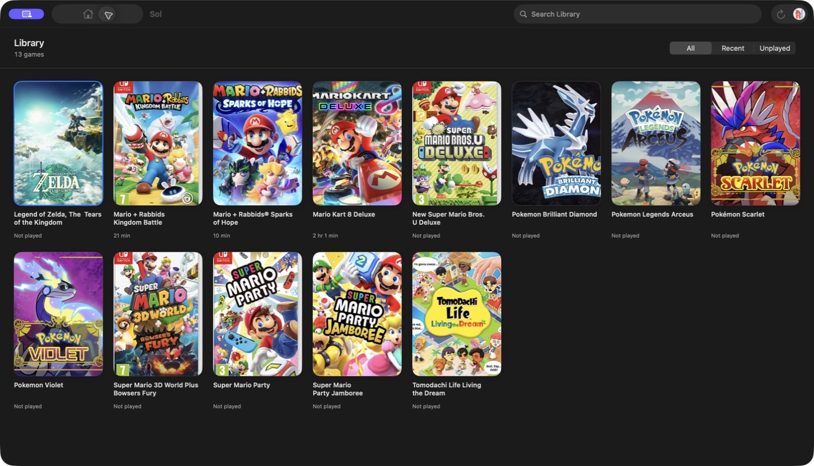
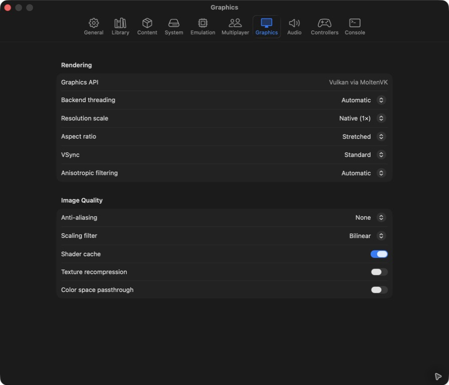
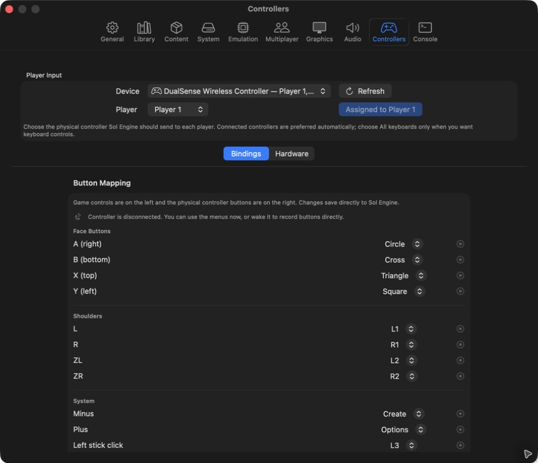

# Sol

Sol is a native macOS app for running Sol Engine. The library, setup,
controller mapping, profiles, settings, launch progress, and session controls
are written with SwiftUI and AppKit. Games render into an AppKit-owned surface
through Vulkan and MoltenVK.

This is an early developer preview. The source is open so the native frontend
and engine boundary can be tested in the open; it is not yet a promise that
every game or controller will behave perfectly.

The preview is source-only for now. A downloadable build will wait until the
app can be distributed with Developer ID signing and Apple notarization.



| Native settings | Controller mapping |
| --- | --- |
|  |  |

The screenshots contain only Sol's interface and local test data. No game
artwork or system files are included in this repository.

## What works

- Native game library, search, profiles, playtime, and artwork caching
- Direct game launch through the bundled, UI-free Sol Engine runtime
- Native launch progress instead of a blank window while caches are prepared
- Pause, resume, stop, fullscreen, volume, VSync, and screenshots
- Keyboard and controller assignment with per-player remapping
- Keys, firmware, DLC, title update, and content-folder management
- Local and internet multiplayer settings exposed through native controls
- Amiibo catalog browsing through AmiiboAPI and the upstream tag database
- Optional Sign in with Apple and iCloud profile linking in provisioned builds
- Widgets, Spotlight, Quick Look, Share, notifications, and the `sol://` URL scheme

## DLSM development benchmark

Tested on the M4's 10-core GPU using Pokémon Legends: Arceus v1.1.1, the same
warmed language screen, and DLSM Quality rendering 2026 × 1103 → 3024 × 1646 —
55.1% fewer internal pixels.

| Mode | Source → output FPS | GPU busy | DLSM GPU median / p95 | Metal memory | Process CPU<sup>*</sup> |
| --- | ---: | ---: | ---: | ---: | ---: |
| Native / Off | 30.0 → 30.0 | 48.1% | 0 ms | 317.5 MiB | 60.4% |
| Spatial Quality | 30.0 → 30.0 | 42.3% | 1.27 / 3.30 ms | 371.9 MiB | 84.4% |
| Temporal Quality | 30.0 → 30.0 | 60.0% | 11.54 / 18.16 ms | 633.9 MiB | 77.7% |
| Temporal + Frame Gen | 21.6 → 43.2 | 72.4% | ≈23.02 / 25.60 ms | 714.4 MiB | 87.2% |

<sup>*</sup> 100% CPU equals one fully occupied CPU core.

DLSM remains an experimental developer feature and is disabled in normal
public-preview launches.

### The honest verdict

- Spatial keeps 30 FPS while reducing GPU activity by about 12%. It is the best
  current mode, though CPU use and frame pacing still need attention.
- Temporal provides no benefit in this capped scene while adding roughly
  316 MiB of Metal memory and substantial GPU cost.
- Frame Generation produces additional frames, but throttles the real renderer
  from 30 to 21.6 FPS. Output reaches 43.2 FPS—not the intended 60—and latency
  will feel worse.
- A GPU-bound, unlocked in-game scene is still needed to measure genuine
  performance uplift. This test primarily measures DLSM pipeline overhead.

## Requirements

- Apple Silicon Mac
- macOS 15 or later
- A current Xcode command-line toolchain
- XcodeGen when changing `project.yml`
- Internet access for the initial engine and .NET SDK download

Sol does not include games, keys, firmware, or other console system files.
Those must come from hardware and content you are legally allowed to use.

## Build from source

Install the project-local .NET SDK, fetch the pinned engine source, and build:

```bash
./script/install_dotnet_sdk.sh
./script/fetch_ryubing_source.sh
SOL_APPLE_SIGNING=off ./script/build_and_run.sh --build
```

The unsigned app will be written to:

```text
/tmp/sol-derived-data/Build/Products/Debug/Sol.app
```

If this Mac has a provisioned Apple Development certificate, omit
`SOL_APPLE_SIGNING=off` for a local signed build. You can also provide a team
explicitly:

```bash
SOL_DEVELOPMENT_TEAM=YOUR_TEAM_ID ./script/build_and_run.sh
```

After changing the XcodeGen specification, regenerate the project with:

```bash
./script/generate_project.sh
```

The first full build takes a while. It compiles a pinned upstream engine,
creates the native bridge, and embeds a private .NET runtime inside the app.

## First run

1. Open Settings and choose a games directory.
2. Open System and install your own keys and firmware.
3. Configure a keyboard or controller under Controllers.
4. Select a game from the library and press Play.

Settings that depend on Apple services require a provisioned build with the
matching App Group, Sign in with Apple, and iCloud capabilities.

## Project layout

- `Sources/Sol` — native macOS app
- `NativeHost` — managed engine entry point and native ABI bridge
- `script/patches` — small, reviewable changes applied to the pinned engine
- `Sources/SolWidgets`, `Sources/SolQuickLook`, `Sources/SolShare` — extensions
- `Tests/SolTests` — Swift regression tests
- `Docs/SOL_ENGINE_ARCHITECTURE.md` — engine and process boundary

The upstream engine checkout and generated binaries are intentionally ignored.
`script/fetch_ryubing_source.sh` fetches commit
`a82350bb774f70fcbd41c9987bf67a3775409963` when needed.

## Network and privacy

Sol has no analytics service. It makes network requests only for features you
use: metadata/artwork lookup, Amiibo data, multiplayer, and Apple account or
iCloud services. Games, keys, firmware, room codes, and save data stay local.

Do not attach copyrighted system files, games, keys, account identifiers, or
private room codes to bug reports. A clean diagnostic log and reproduction
steps are usually enough.

## Contributing

Bug reports and focused pull requests are welcome. Read
[`CONTRIBUTING.md`](CONTRIBUTING.md) before opening one. This project is still
settling its engine ABI, so large refactors should start as a discussion.

## Upstream and legal

Sol Engine is built from and modifies the MIT-licensed Ryujinx/Ryubing codebase.
Attribution and dependency notices are kept in
[`THIRD_PARTY_NOTICES.md`](THIRD_PARTY_NOTICES.md) and are embedded in packaged
apps.

Sol is an independent project. It is not affiliated with or endorsed by Apple,
Nintendo, Ryujinx, or Ryubing. See [`LICENSE`](LICENSE) for Sol's code license.
